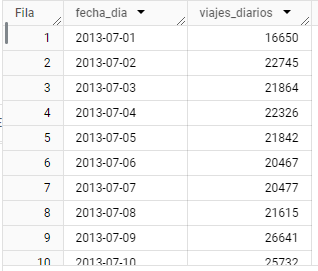

# 🚴♂ Crecimiento del número de viajes diarios a lo largo del tiempo.

```sql
SELECT
  DATE(starttime) AS fecha_dia,
  COUNT(*) AS viajes_diarios
FROM
  `citi-bike-ny.bike_ny.view_totalTrips`
GROUP BY
  fecha_dia
ORDER BY
  fecha_dia;
```

<figure><figcaption></figcaption></figure>
